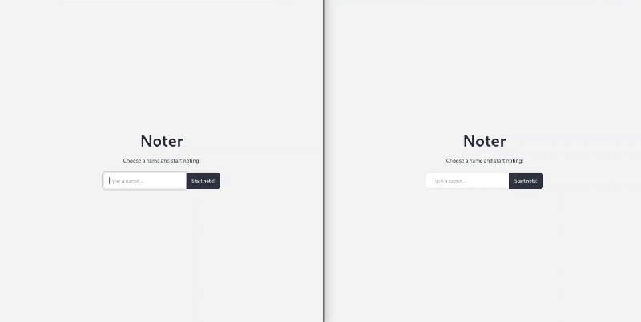
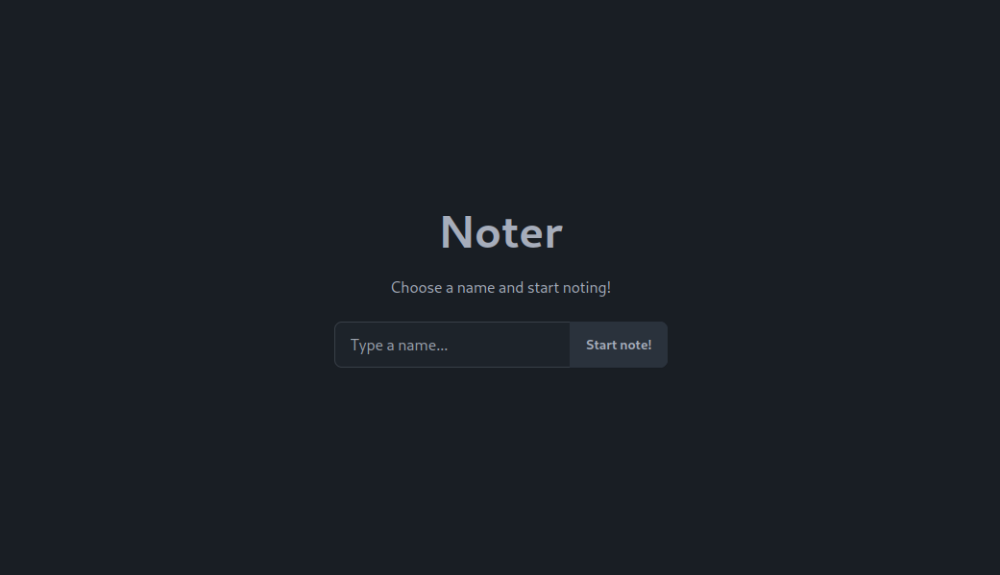
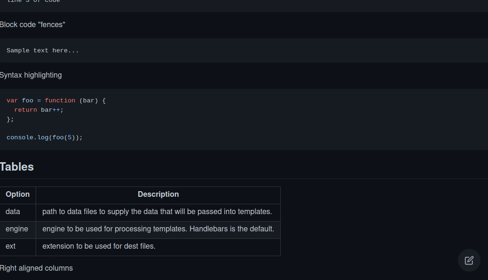
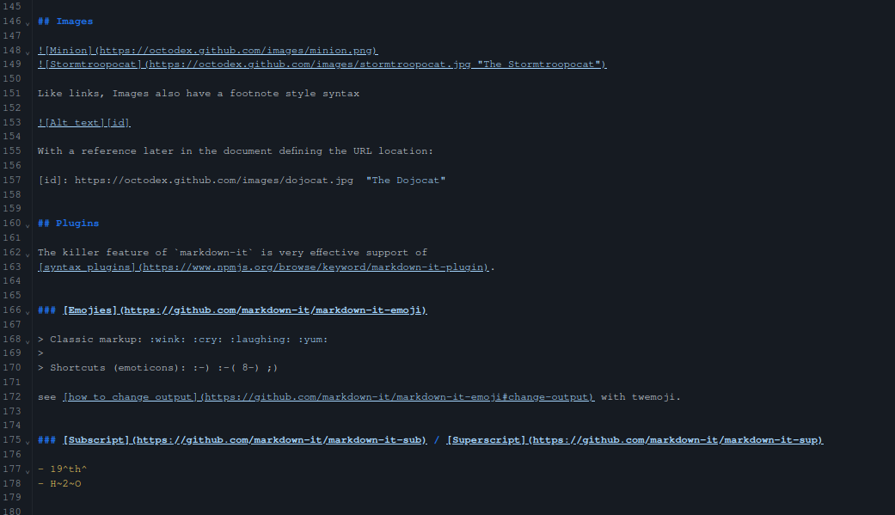
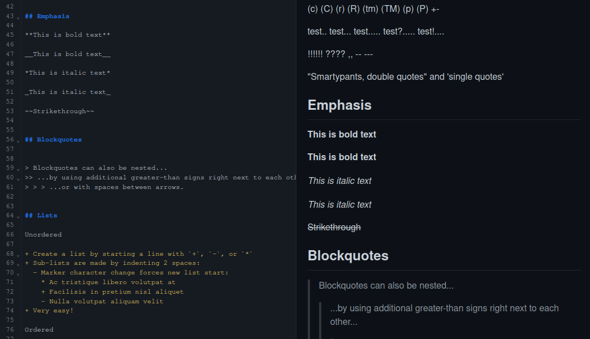

# Noter 📝


> Escolha um nome e comece a anotar com o Noter!

Noter é um sistema abrangente de gerenciamento de documentos projetado para ajudá-lo a organizar e
editar seus documentos sem esforço. Com sua interface amigável e recursos facilitadores, o Noter
simplifica a maneira como você lida com seus documentos, seja para trabalho, estudo ou uso pessoal.

## Funcionalidades

✨ **Acesso sem Esforço**: Basta inserir o nome do documento para acessar/editar o seu conteúdo.

📝 **Editor de Markdown**: Edite seus documentos com facilidade usando o editor Markdown integrado do
Noter.

🔄 **Atualizações em Tempo Real**: Experimente atualizações em tempo real perfeitas ao colaborar em
documentos com outras pessoas.


*Gif 1: Preview do Noter*

## Como Começar

Para começar com o Noter, siga estas etapas simples:

### Backend

1. **Clonar o Repositório**: Clone o repositório do Noter em sua máquina local.

```
git clone https://github.com/reedbluue/noter.git
```

2. **Construir e Executar o Backend**: Navegue até o diretório do projeto backend e execute o
   seguinte comando para construir e executar o backend.

```
cd noter-backend
docker build -t noter-backend .
docker run -p 8081:8081 --env-file .env noter-backend
```

Certifique-se de configurar suas variáveis de ambiente no arquivo `.env` para configurar o banco de
dados, se necessário.

### Frontend

3. **Instalar Dependências**: Navegue até o diretório do projeto frontend e instale as dependências
   necessárias.

```
cd ../noter-frontend
npm install
```

4. **Construir e Executar o Frontend**: Execute o seguinte comando para construir e executar o
   frontend.

```
npm run build
docker build -t noter-frontend .
docker run -p 80:80 noter-frontend
```

## Variáveis de Ambiente

As seguintes variáveis de ambiente podem ser configuradas no arquivo `.env` para configurar o banco
de dados:

- `DB_USER`: Nome de usuário do banco de dados.
- `DB_PASSWORD`: Senha do banco de dados.
- `DB_HOST`: Host do banco de dados.
- `DB_PORT`: Porta do banco de dados.
- `DB_NAME`: Nome do banco de dados.

## Como Começar com Docker Compose

Para simplificar o processo de execução das aplicações, você pode usar o Docker Compose.
Certifique-se de ter o Docker e o Docker Compose instalados em sua máquina antes de prosseguir.

1. **Definir o Arquivo `docker-compose.yml`**: Crie um arquivo chamado `docker-compose.yml` na raiz
   do seu projeto com o seguinte conteúdo:

```yaml
version: "3.8"
services:
  noter-backend:
    build:
      context: ./noter-backend
    environment:
      - DB_USER=postgres
      - DB_PASSWORD=postgres
      - DB_HOST=postgres
      - DB_PORT=5432
      - DB_NAME=NOTERDB
    ports:
      - "8081:8081"
    depends_on:
      - postgres

  noter-frontend:
    build:
      context: ./noter-frontend
    ports:
      - "80:80"

  postgres:
    image: postgres
    environment:
      POSTGRES_USER: postgres
      POSTGRES_PASSWORD: postgres
      POSTGRES_DB: NOTERDB
```

Este arquivo `docker-compose.yml` define três serviços: `noter-backend`, `noter-frontend`
e `postgres`. Ele também configura as variáveis de ambiente necessárias para o banco de dados.

2. **Executar o Docker Compose**: No terminal, navegue até o diretório onde está o
   arquivo `docker-compose.yml` e execute o seguinte comando:

```
docker-compose up --build
```

Este comando irá construir as imagens Docker para cada serviço, criar e iniciar os contêineres.

3. **Acessar o Noter**: Uma vez que os contêineres estejam em execução, abra seu navegador da web e
   vá para `http://localhost` para acessar o Noter.

Com o Docker Compose, você pode facilmente construir e executar a aplicação Noter.

## Screenshots


*Figura 1: Página Inicial do Noter*


*Figura 2: Visualização de documento do Noter*


*Figura 2: Editor de Documentos do Noter*


*Figura 2: Preview em tempo real do Noter*

## Tecnologias Utilizadas

- **Backend**: Java, Spring Boot
- **Frontend**: React, TypeScript
- **Banco de Dados**: PostgreSQL
- **Contêiner**: Docker
- **Implantação**: Amazon Corretto, NGINX

## Contribuições

Contribuições são bem-vindas! Se você tiver alguma sugestão, relatório de bug ou solicitação de
recurso, sinta-se à vontade para abrir uma issue ou enviar um pull request.

## Licença

Este projeto está licenciado sob a Licença MIT - consulte o
arquivo [LICENSE](./LICENSE.md) para obter detalhes.